# PulseForge: Project Insights

The PulseForge Insights Dashboard is a robust web application designed to streamline project management tasks and enhance productivity.
Built using HTML and CSS, this dashboard provides a seamless multi-page experience, offering a comprehensive overview of project analytics along with detailed insights into various project aspects.
Additionally, it includes pages to manage users, projects, and personal profiles, empowering users to efficiently organize and track their project activities.

## Technologies & Design Approach

Utilizes a robust multiple-page routing system for seamless navigation,
Allows users to switch between project overview, task lists, and team collaboration pages,
Prioritizes responsiveness across various devices, ensuring optimal user experience on desktops, tablets, and mobiles, while using my own styling framework.

Hosted at -> https://pulse-forge-insights.netlify.app

## Demo 
Note: This is a small sample view the deployed version on the provided link above

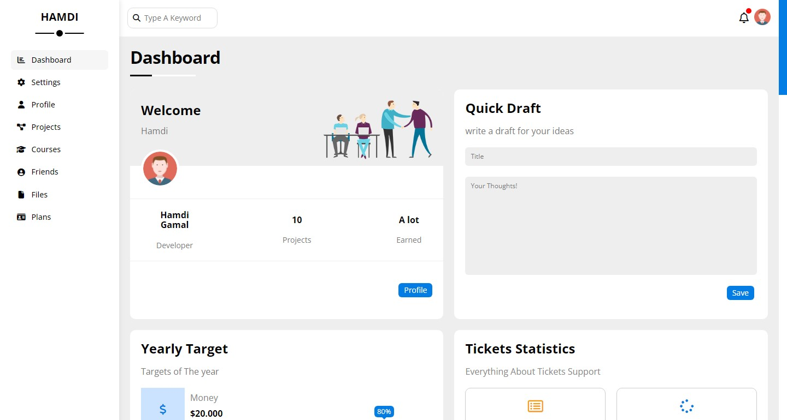
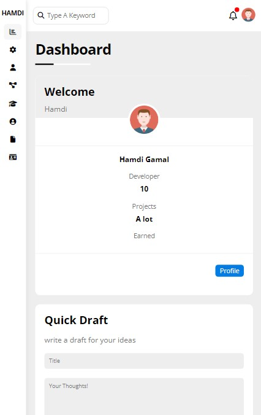
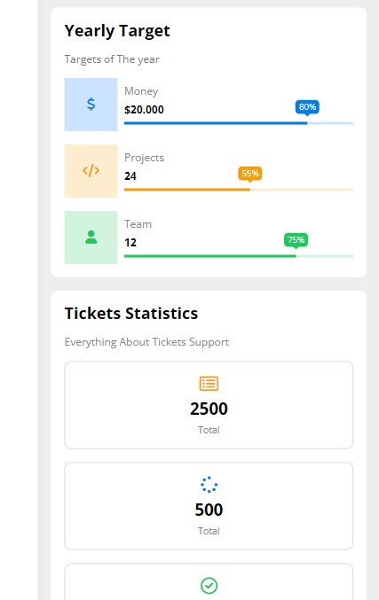

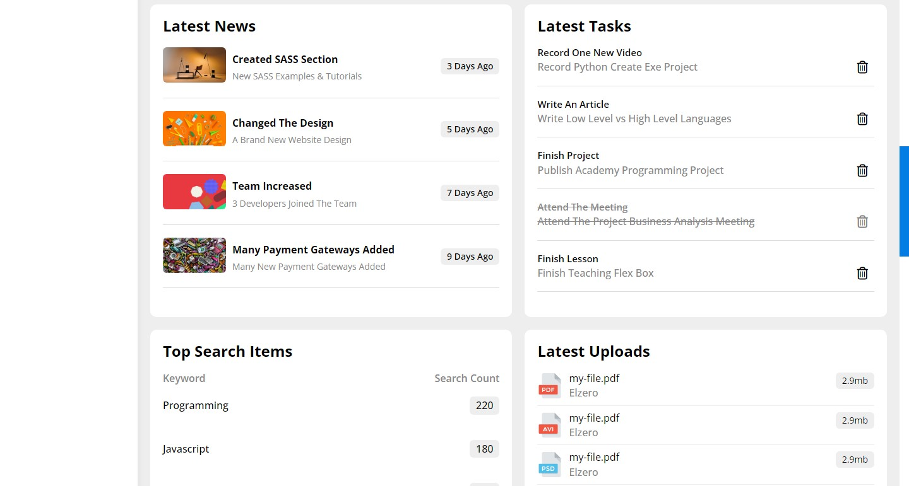
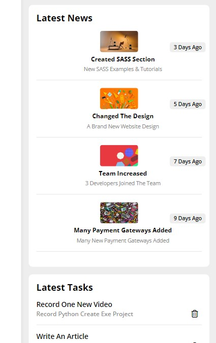
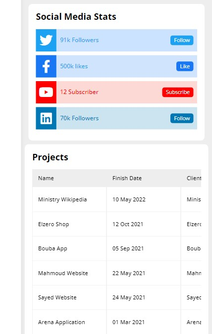

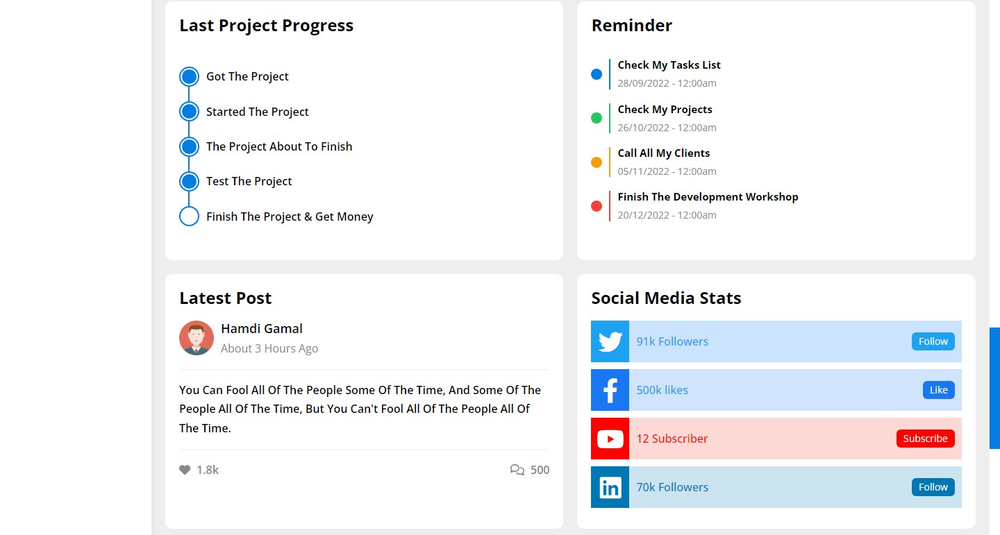
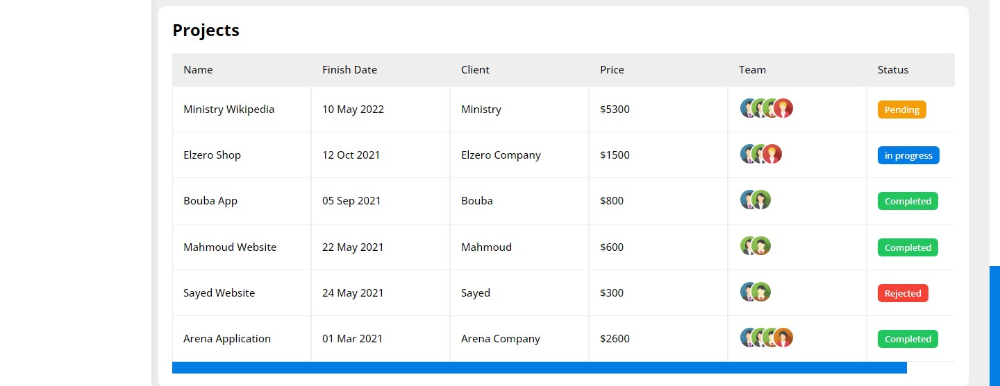
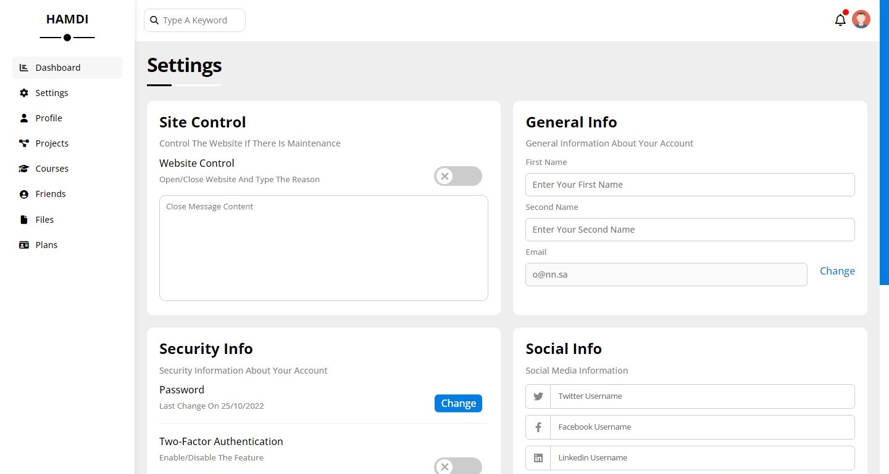
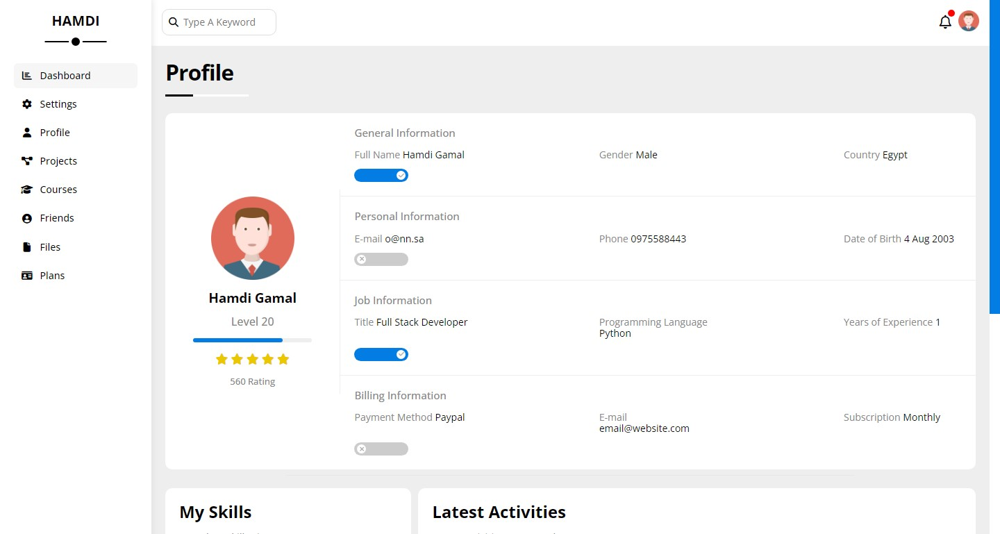
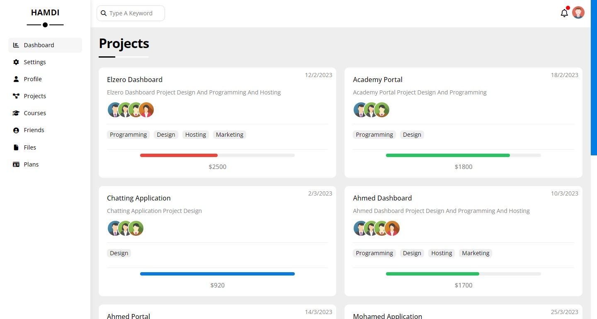
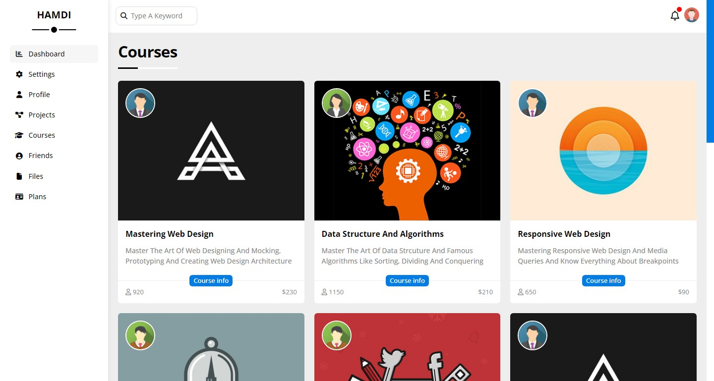
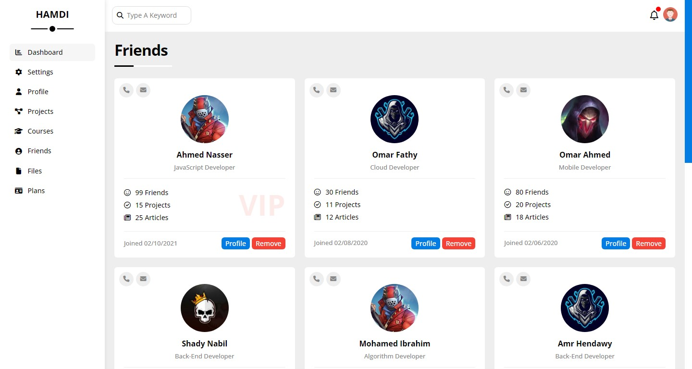
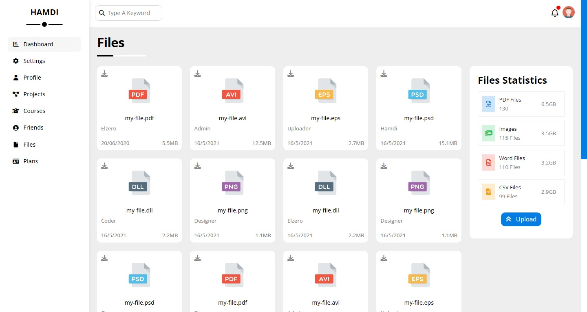

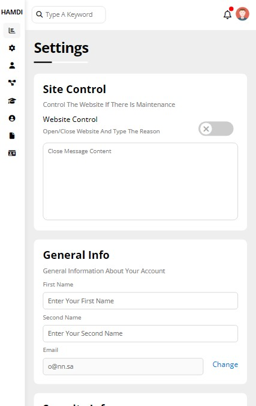
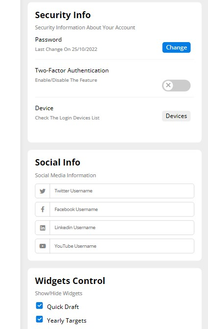
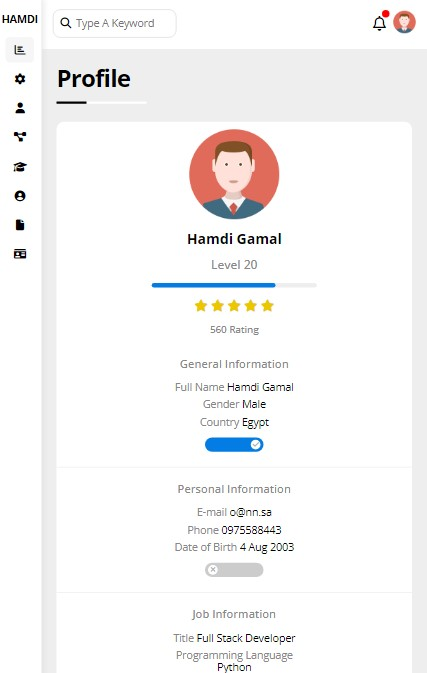
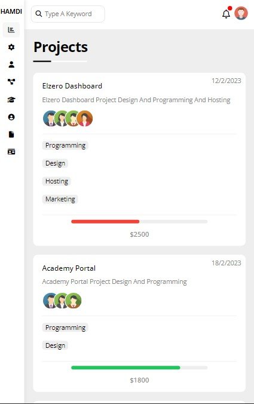
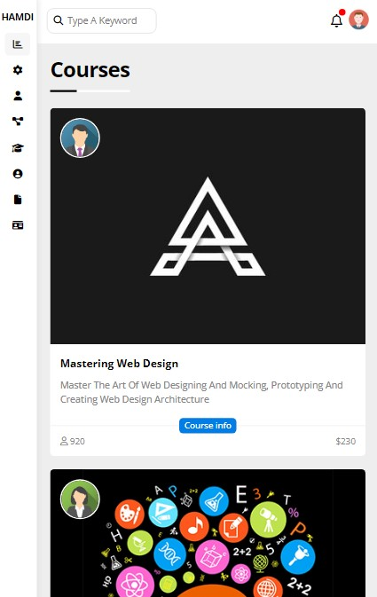
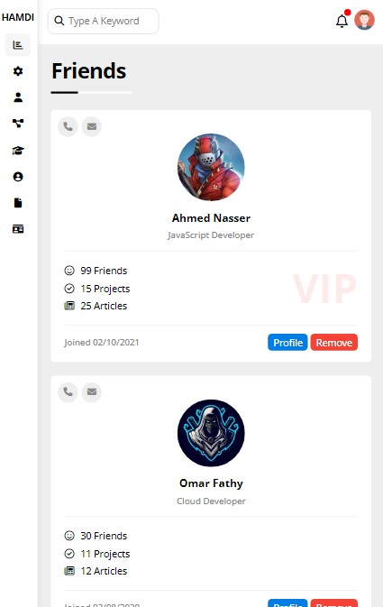
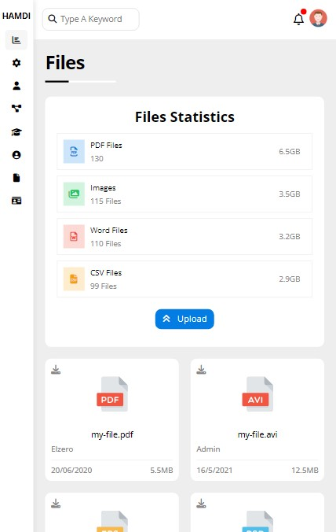
